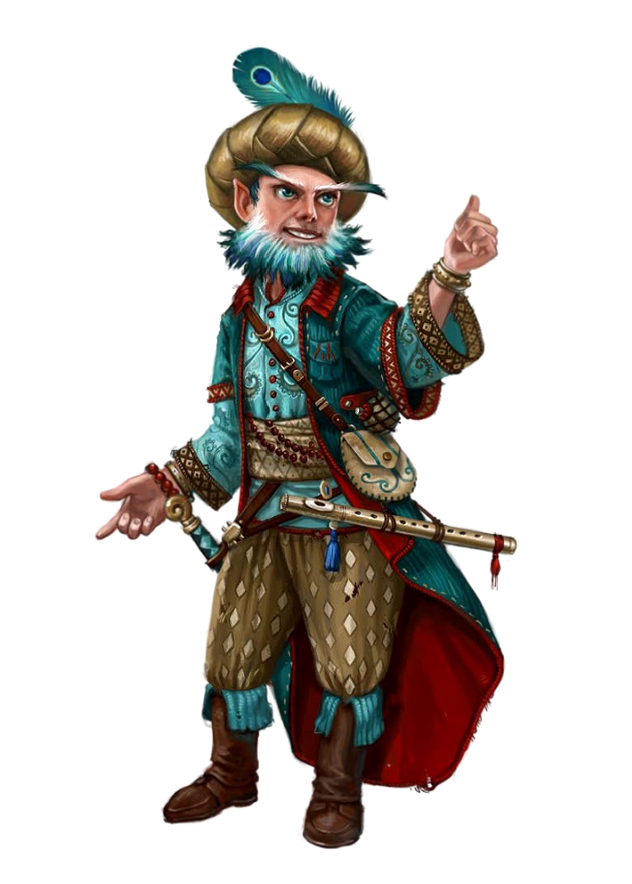

%%
Creator:: Lucas
Universe:: D%D Forgotten Realms
Campaign:: John
Adventure_Diary:: v1
%%

# Maurice
> (Description:: ) Um gnomo contador de histórias.

![[Frase]] <i></i>

||
----|:---:|
**Classe** |  Bardo
**Level** |  3
**Raça** |  Gnomo das Profundezas
**Alinhamento** |  Caótico Neutro
**Background** |  Artista
**Altura** | 110cm

---
# Stats
CA | Deslocamento | Iniciativa |
:---:|:---:|:---:|
 14 | 7,5m | +5 |

Pontos de Vida | Dados de Vida | Pontos de Vida Temporários | 
:---:|:---:|:---:|
17 | 3D8 | 0 |

||
----|:----:|
**Bônus de Proeficiência** |  +2
Sabedoria Passiva (Percepção) | 13 | 

## Habilidades
### Habilidades
FORÇA | DES | CON | INT | SAB | CARISMA ||
:---:|:----:|:---:|:----:|:---:|:----:|---|
 11 | 16 | 9 | 15 | 15 | 16 | **Stats** |
+0  | +3  | -1  | +2 | +2 | +3 | **Bônus** |
.  | X | . | . | . | X | **Teste de Resistência** |

### Perícias
\# | Perícia | Bônus |
:--:|-----|:------:|
X | Acrobacia | DES |
.| Lidar com Animais | SAB |
.| Arcanismo | INT |
.| Atletismo | FOR |
2\*X | Blefar | CAR |
X | História | INT |
.| Intuição | SAB |
.| Intimidação | CAR |
X | Investigação | INT |
.| Medicina | SAB |
X | Natureza | SAB |
2\*X | Percepção | SAB |
. | Atuação | CAR |
X | Persuasão | CAR |
.| Religião | INT |
.| Prestidigitação | DES |
X | Furtividade | DES |
.| Sobrevivência | SAB |

# Caracterísitcas

## Cararcterísitas e Habilidades
- **Camuflagem de Pedra:** Bônus para se esconder em pedras
- Visão no Escuro (36,5m)
- **Esperteza Gnômica:** Vantagem em TR de INT, SAB e CAR contra magias
- **Magia Svnirfneblin:** possos castar 1x por dia as magias cegueira/surdez, disfarçar-se, blur e nondetection usando a inteligência
- **Inspiração de Bardo:** ação bônus, dar 1D6 para uma criatura que possa me ouvir até 18m. Usos igual o modificador de carisma
- **Versatilidade:** Adiciono metade do bônus de proeficiência a qualquer teste de habilidade que eu não tenha proeficiência
- **Canção do Descanso:** Durante um descanso curto, quem me ouvir recupera 1D6
- **Aptidão:** Dobro de bônus de duas períficas (marcadas com 2\*X)
- **Colégio do Conhecimento**
	- +3 proeficiências
	- **Palavras de Interrupção:** reação, uso de inspiração de bardo, afeta uma criatura que possa me ouvir até 18m, em qualquer rolagem dela subtrai 1D6. 

## Proeficiências
- **Armaduras:** Armaduras Leves
- **Armas:** Armas simples, espadas longas, rapieiras, espadas curtas, bestas de mão
- **Ferramentas:** tambor, bandolim, (instrumento musical)

## Idiomas
- Comum
- Gnomo (alfabeto anão)
- Subcomum

## Equipamento
- Armadura de couro
- Adaga
- Besta Simples

# Actions

`button-action`

## Magias

|||
:---:|:---:|:---:
CD Magias | 8 + Proeficiência + Mod Car | 13
Mod Ataque Magias | Proeficiência + Mod Car | 5

Level | Espaços de Magia | Magias Conhecidas/Preparadas |
:---:|:---:|:---:|
0 | $\infty$ | 2 |
1 | 4 | 4 |
2 | 2 | 2 |
 
 

# Equipment
CP | SP | EP | GP | PP |
:---:|:---:|:---:|:---:|:---:|
|||||

- 

# Personality
###### Personality Traits

###### Ideals

###### Bonds

###### Flaws
